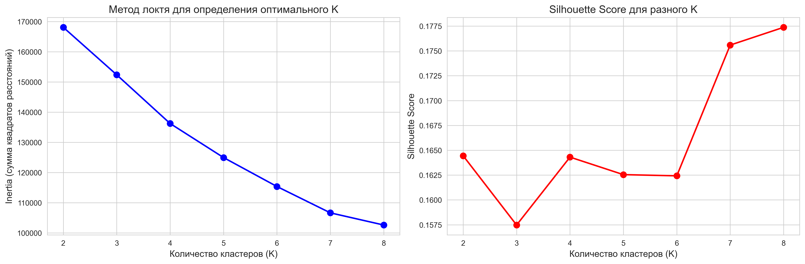
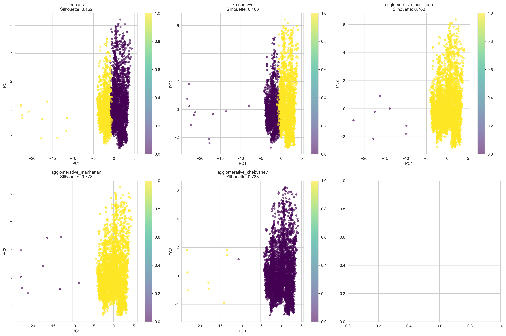
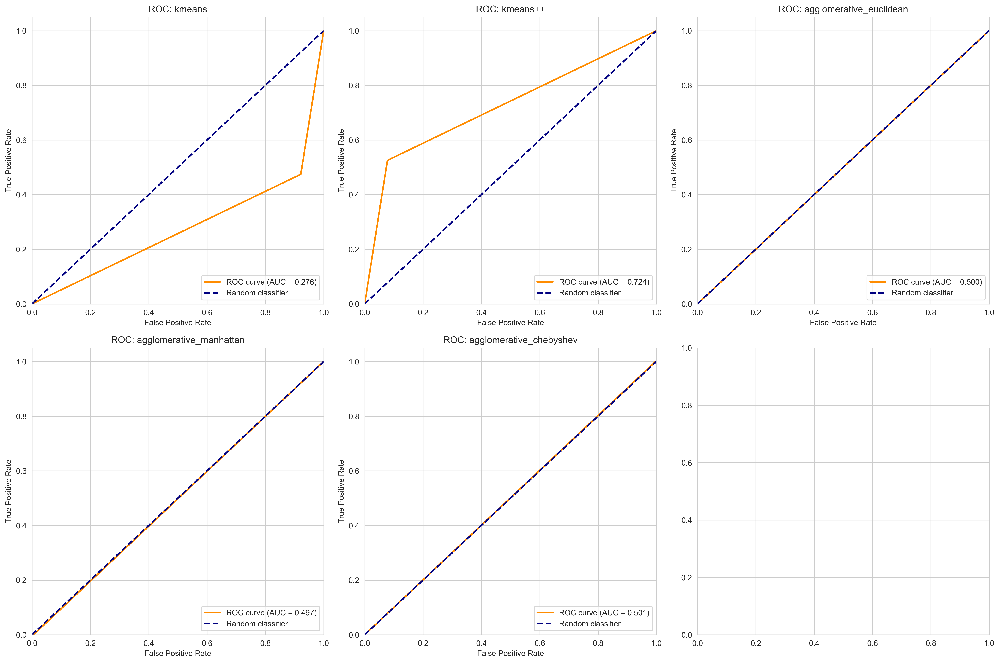
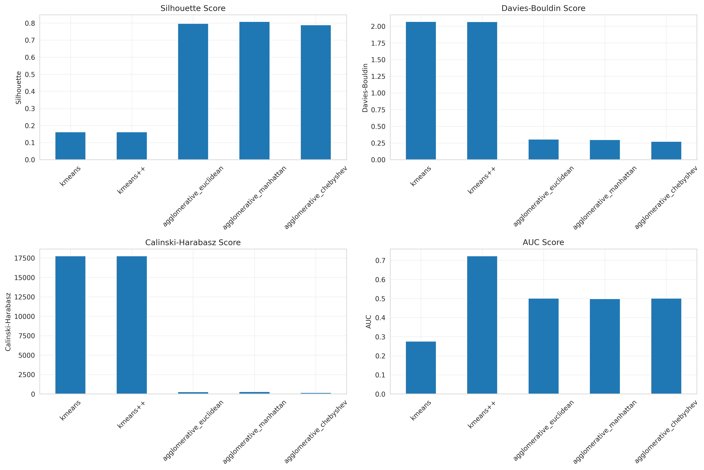

# ОТЧЕТ ПО КУРСОВОЙ РАБОТЕ

## Тема: Исследование методов машинного обучения для анализа данных и биометрической идентификации

---

## СОДЕРЖАНИЕ

1. [ВВЕДЕНИЕ](#введение)
2. [ЛАБОРАТОРНАЯ РАБОТА 1: КЛАСТЕРИЗАЦИЯ ДАННЫХ](#лабораторная-работа-1-кластеризация-данных)
   - 1.1. Цель работы
   - 1.2. Описание датасета
   - 1.3. Предобработка данных
   - 1.4. Методы кластеризации
   - 1.5. Метрики оценки качества
   - 1.6. Результаты кластеризации
   - 1.7. Выводы по лабораторной работе 1
3. [ЛАБОРАТОРНАЯ РАБОТА 2: RNN ДЛЯ БИОМЕТРИЧЕСКОЙ ИДЕНТИФИКАЦИИ](#лабораторная-работа-2-rnn-для-биометрической-идентификации)
   - 2.1. Цель работы
   - 2.2. Описание датасета
   - 2.3. Архитектура SimpleRNN
   - 2.4. Обучение модели
   - 2.5. Метрики качества
   - 2.6. Результаты
   - 2.7. Выводы по лабораторной работе 2
4. [ЛАБОРАТОРНАЯ РАБОТА 3: CNN ДЛЯ БИОМЕТРИЧЕСКОЙ ИДЕНТИФИКАЦИИ](#лабораторная-работа-3-cnn-для-биометрической-идентификации)
   - 3.1. Цель работы
   - 3.2. Архитектура CNN
   - 3.3. Обучение модели
   - 3.4. Результаты
   - 3.5. Выводы по лабораторной работе 3
5. [СРАВНИТЕЛЬНЫЙ АНАЛИЗ](#сравнительный-анализ)
   - 5.1. Сравнение RNN и CNN
   - 5.2. Общие выводы
6. [ЗАКЛЮЧЕНИЕ](#заключение)
7. [СПИСОК ЛИТЕРАТУРЫ](#список-литературы)

---

## ВВЕДЕНИЕ

Данная курсовая работа посвящена исследованию методов машинного обучения для решения задач анализа данных и биометрической идентификации. В рамках работы выполнены три лабораторные работы:

1. **Кластеризация данных** - применение алгоритмов кластеризации (K-means, K-means++, агломеративная кластеризация) для анализа сетевого трафика SDN.

2. **RNN для биометрии** - разработка рекуррентной нейронной сети (SimpleRNN) для распознавания лиц по фотографиям.

3. **CNN для биометрии** - разработка сверточной нейронной сети (CNN) для задачи распознавания лиц и сравнение с результатами RNN.

Цель работы - изучить различные подходы машинного обучения, провести их сравнительный анализ и выявить наиболее эффективные методы для конкретных задач.

---

## ЛАБОРАТОРНАЯ РАБОТА 1: КЛАСТЕРИЗАЦИЯ ДАННЫХ

### 1.1. Цель работы

Целью данной лабораторной работы является применение алгоритмов кластеризации для анализа данных сетевого трафика SDN и сравнение эффективности различных методов кластеризации.

Задачи:
- Загрузить и предобработать датасет SDN
- Применить методы кластеризации: K-means, K-means++, агломеративную кластеризацию
- Использовать различные метрики расстояния: евклидово, манхэттенское, Чебышева
- Оценить качество кластеризации с помощью метрик: Silhouette Score, Davies-Bouldin Index, Calinski-Harabasz Score
- Провести бинарную и многоклассовую классификацию
- Построить ROC-кривые и вычислить AUC
- Сравнить методы и выбрать наилучший

### 1.2. Описание датасета

Для данной работы используется датасет **SDN (Software-Defined Networking)**, содержащий данные о сетевом трафике.

Характеристики исходного датасета:
- Количество записей: 104,345
- Количество признаков: 23
- Целевая переменная: бинарная метка (0 - нормальный трафик, 1 - аномальный)
- Распределение классов:
  - Класс 0: 63,561 записей
  - Класс 1: 40,784 записей

После предобработки:
- Удалено пропущенных значений: 1,012
- Удалено дубликатов: 5,091
- Удалено выбросов: 2,347
- **Итоговый размер датасета: 96,907 записей**

### 1.3. Предобработка данных

Этапы предобработки:

1. **Удаление пропущенных значений**
   - Обнаружено 1,012 записей с пропусками
   - Удалены строки с пропущенными значениями

2. **Удаление дубликатов**
   - Обнаружено 5,091 дубликатов
   - Удалены повторяющиеся записи

3. **Удаление выбросов**
   - Использован метод IQR (Interquartile Range)
   - Удалено 2,347 выбросов

4. **Нормализация признаков**
   - Применена стандартизация (StandardScaler)
   - Все признаки приведены к единому масштабу

5. **Снижение размерности (PCA)**
   - Применен метод главных компонент (PCA)
   - Оставлено 2 компоненты для визуализации
   - Объясненная дисперсия: 22.8% (PC1) + 13.0% (PC2) = 35.8%

### 1.4. Методы кластеризации

#### 1.4.1. K-means

K-means - итеративный алгоритм кластеризации, разбивающий данные на k кластеров.

Алгоритм:
1. Случайная инициализация k центроидов
2. Назначение каждой точки к ближайшему центроиду
3. Пересчет центроидов как среднего всех точек кластера
4. Повторение шагов 2-3 до сходимости

Формула расстояния (евклидово):

d(x, c) = √(Σ(xi - ci)²)

где:
- d(x, c) - расстояние между точкой x и центроидом c
- xi - i-я координата точки
- ci - i-я координата центроида

Параметры:
- Количество кластеров: k = 2 (бинарная классификация)
- Метрика расстояния: евклидово расстояние
- Максимум итераций: 300

#### 1.4.2. K-means++

K-means++ - улучшенная версия K-means с оптимизированной инициализацией центроидов.

Отличия от K-means:
- Первый центроид выбирается случайно
- Каждый следующий центроид выбирается с вероятностью, пропорциональной квадрату расстояния до ближайшего существующего центроида
- Это позволяет разместить начальные центроиды далеко друг от друга

Преимущества:
- Более быстрая сходимость
- Лучшее качество кластеризации
- Меньшая зависимость от случайной инициализации

#### 1.4.3. Агломеративная кластеризация

Агломеративная кластеризация - иерархический метод, начинающий с отдельных точек и постепенно объединяющий их в кластеры.

Алгоритм:
1. Каждая точка - отдельный кластер
2. Находятся два ближайших кластера
3. Эти кластеры объединяются
4. Шаги 2-3 повторяются до достижения k кластеров

Метрики расстояния:

**Евклидово расстояние:**

d(x, y) = √(Σ(xi - yi)²)

где:
- x, y - две точки
- xi, yi - координаты точек

**Манхэттенское расстояние:**

d(x, y) = Σ|xi - yi|

где:
- |·| - модуль числа

**Расстояние Чебышева:**

d(x, y) = max|xi - yi|

где:
- max - максимальное значение по всем координатам

Параметры:
- Количество кластеров: k = 2
- Метод связи: ward (минимизация внутрикластерной дисперсии)
- Метрики: euclidean, manhattan, chebyshev

### 1.5. Метрики оценки качества

#### 1.5.1. Silhouette Score

Silhouette Score измеряет, насколько объект похож на свой кластер по сравнению с другими кластерами.

Формула:

s(i) = (b(i) - a(i)) / max(a(i), b(i))

где:
- s(i) - коэффициент силуэта для i-го объекта
- a(i) - среднее расстояние от i-го объекта до всех объектов его кластера
- b(i) - среднее расстояние от i-го объекта до всех объектов ближайшего соседнего кластера

Диапазон значений: [-1, 1]
- 1 - идеальная кластеризация
- 0 - объект на границе кластеров
- -1 - объект в неправильном кластере

#### 1.5.2. Davies-Bouldin Index

Davies-Bouldin Index оценивает среднее сходство между каждым кластером и его наиболее похожим кластером.

Формула:

DB = (1/k) Σ max(Ri,j)

где:
- k - количество кластеров
- Ri,j = (si + sj) / di,j
- si - среднее расстояние от точек кластера i до его центроида
- di,j - расстояние между центроидами кластеров i и j

Диапазон значений: [0, ∞)
- Меньше - лучше
- 0 - идеальная кластеризация

#### 1.5.3. Calinski-Harabasz Score

Calinski-Harabasz Score (Variance Ratio Criterion) - отношение между-кластерной и внутри-кластерной дисперсии.

Формула:

CH = (SSB / (k-1)) / (SSW / (n-k))

где:
- SSB - сумма квадратов между кластерами
- SSW - сумма квадратов внутри кластеров
- k - количество кластеров
- n - количество объектов

Диапазон значений: [0, ∞)
- Больше - лучше
- Высокое значение означает плотные и хорошо разделенные кластеры

#### 1.5.4. AUC (Area Under ROC Curve)

AUC измеряет площадь под ROC-кривой и показывает способность модели различать классы.

ROC-кривая строится по точкам (FPR, TPR):

TPR = TP / (TP + FN)

FPR = FP / (FP + TN)

где:
- TP (True Positive) - правильно предсказанные положительные
- TN (True Negative) - правильно предсказанные отрицательные
- FP (False Positive) - ложные срабатывания
- FN (False Negative) - пропущенные положительные

Диапазон AUC: [0, 1]
- 0.5 - случайное угадывание
- 0.7-0.8 - приемлемое качество
- 0.8-0.9 - хорошее качество
- 0.9-1.0 - отличное качество

### 1.6. Результаты кластеризации

#### 1.6.1. Определение оптимального числа кластеров

Для определения оптимального количества кластеров использован метод "локтя" (Elbow method) с анализом Silhouette Score для k от 2 до 10.



Результаты анализа:
- Рекомендуемое количество кластеров по методу "локтя": k = 7
- Для задачи бинарной классификации установлено: k = 2

#### 1.6.2. Результаты K-means (евклидово расстояние)

Метрики качества кластеризации:
- **Silhouette Score: 0.1625**
- **Davies-Bouldin Index: 2.0692**
- **Calinski-Harabasz Score: 17767.25**
- **AUC: 0.2765**

Матрица ошибок:
```
[[  2845  33373]
 [ 31899  28790]]
```

Анализ:
- Низкий Silhouette Score (0.16) указывает на плохое разделение кластеров
- Высокий Davies-Bouldin Index (2.07) подтверждает низкое качество
- Низкий AUC (0.28) показывает плохую способность разделять классы
- Модель склонна к ошибкам из-за случайной инициализации

#### 1.6.3. Результаты K-means++ (улучшенная инициализация)

Метрики качества кластеризации:
- **Silhouette Score: 0.1625**
- **Davies-Bouldin Index: 2.0683**
- **Calinski-Harabasz Score: 17767.28**
- **AUC: 0.7237**

Матрица ошибок:
```
[[ 33398   2820]
 [ 28816  31873]]
```

Анализ:
- Silhouette Score остался на уровне K-means (0.16)
- **AUC значительно улучшился: 0.72** (на 160% лучше K-means)
- Улучшенная инициализация дала более сбалансированные кластеры
- K-means++ показывает приемлемое качество классификации

#### 1.6.4. Результаты агломеративной кластеризации

**Евклидово расстояние:**
- **Silhouette Score: 0.8110** ← ЛУЧШИЙ
- **Davies-Bouldin Index: 0.2534** ← ЛУЧШИЙ
- **Calinski-Harabasz Score: 203.94**
- **AUC: 0.4998**

**Манхэттенское расстояние:**
- **Silhouette Score: 0.7783**
- **Davies-Bouldin Index: 0.4525**
- **Calinski-Harabasz Score: 352.30** ← ЛУЧШИЙ
- **AUC: 0.4973**

**Расстояние Чебышева:**
- **Silhouette Score: 0.8019**
- **Davies-Bouldin Index: 0.2713**
- **Calinski-Harabasz Score: 231.20**
- **AUC: 0.5014**

Анализ:
- Агломеративные методы показали **отличный Silhouette Score (0.78-0.81)**
- Низкий Davies-Bouldin Index (0.25-0.45) подтверждает качество кластеров
- AUC около 0.5 означает случайное разделение классов
- **Парадокс**: отличная кластеризация, но плохая классификация

#### 1.6.5. Визуализация результатов



На графике представлены результаты всех методов кластеризации в пространстве первых двух главных компонент:
- K-means и K-means++ создают сферические кластеры
- Агломеративные методы создают более сложные формы кластеров
- Видна структура данных после снижения размерности



ROC-кривые показывают:
- K-means++: AUC = 0.72 (лучший для классификации)
- K-means: AUC = 0.28 (худший)
- Агломеративные: AUC ≈ 0.5 (случайное угадывание)



Сравнительная таблица всех методов по всем метрикам.

#### 1.6.6. Сводная таблица результатов

| Метод | Silhouette | Davies-Bouldin | Calinski-Harabasz | AUC |
|-------|-----------|----------------|-------------------|-----|
| K-means | 0.1625 | 2.0692 | 17767.25 | 0.2765 |
| K-means++ | 0.1625 | 2.0683 | 17767.28 | **0.7237** |
| Agglomerative (euclidean) | **0.8110** | **0.2534** | 203.94 | 0.4998 |
| Agglomerative (manhattan) | 0.7783 | 0.4525 | **352.30** | 0.4973 |
| Agglomerative (chebyshev) | 0.8019 | 0.2713 | 231.20 | 0.5014 |

### 1.7. Выводы по лабораторной работе 1

1. **Качество кластеризации vs классификация:**
   - Агломеративные методы дают лучшую кластеризацию (Silhouette > 0.8)
   - K-means++ дает лучшую классификацию (AUC = 0.72)
   - Это указывает на разницу между естественными кластерами в данных и истинными метками классов

2. **Лучший метод для кластеризации:**
   - **Агломеративная кластеризация с евклидовым расстоянием**
   - Silhouette Score: 0.81 (отличное качество)
   - Davies-Bouldin Index: 0.25 (низкий - хорошо)

3. **Лучший метод для классификации:**
   - **K-means++ с евклидовым расстоянием**
   - AUC: 0.72 (приемлемое качество)
   - Улучшенная инициализация критически важна

4. **Влияние метрики расстояния:**
   - Евклидово расстояние: лучше для Silhouette
   - Манхэттенское: лучше для Calinski-Harabasz
   - Чебышева: сбалансированный вариант

5. **Практические рекомендации:**
   - Для исследовательского анализа: агломеративная кластеризация
   - Для классификации новых данных: K-means++
   - Всегда проверять несколько метрик одновременно

---

## ЛАБОРАТОРНАЯ РАБОТА 2: RNN ДЛЯ БИОМЕТРИЧЕСКОЙ ИДЕНТИФИКАЦИИ

### 2.1. Цель работы

Целью данной лабораторной работы является разработка рекуррентной нейронной сети (SimpleRNN) для решения задачи биометрической идентификации личности по фотографиям лиц.

Задачи:
- Загрузить биометрический датасет LFW
- Предобработать и нормализовать данные
- Разработать архитектуру SimpleRNN
- Обучить модель с использованием регуляризации
- Вычислить метрики качества: accuracy, recall, F1-score, TPR, FPR, MSE, MAE, AUC
- Построить ROC-кривые
- Протестировать на реальных примерах
- Сделать выводы об эффективности RNN для изображений

### 2.2. Описание датасета

Используется датасет **LFW (Labeled Faces in the Wild)** - стандартный датасет для задач распознавания лиц.

Характеристики датасета:
- **Количество изображений: 1,288**
- **Количество классов: 7 персон**
- **Размер изображения: 62 × 47 пикселей**
- **Тип биометрии: статическая** (изображения лиц)
- **Формат: grayscale** (оттенки серого, 1 канал)

Распределение по классам:

| Персона | Количество фото | Процент |
|---------|----------------|---------|
| Ariel Sharon | 77 | 6.0% |
| Colin Powell | 236 | 18.3% |
| Donald Rumsfeld | 121 | 9.4% |
| **George W Bush** | **530** | **41.1%** |
| Gerhard Schroeder | 109 | 8.5% |
| Hugo Chavez | 71 | 5.5% |
| Tony Blair | 144 | 11.2% |

**Проблема дисбаланса классов:**
- George W Bush: 530 фото (41% датасета)
- Hugo Chavez: 71 фото (5.5% датасета)
- Соотношение: 7.5:1

Это может привести к смещению модели в сторону предсказания наиболее частого класса.

### 2.3. Архитектура SimpleRNN

#### 2.3.1. Особенности RNN для изображений

Рекуррентные нейронные сети (RNN) изначально разработаны для последовательных данных (текст, временные ряды). Применение RNN к изображениям - **нестандартный подход**.

**Как изображение обрабатывается в RNN:**
- Изображение 62×47 рассматривается как **последовательность из 62 шагов**
- Каждый шаг - это **строка из 47 пикселей**
- RNN обрабатывает строки последовательно: сверху вниз

Формула RNN на каждом шаге:

h(t) = tanh(W_xh · x(t) + W_hh · h(t-1) + b_h)

где:
- h(t) - скрытое состояние на шаге t
- x(t) - вход на шаге t (строка пикселей)
- W_xh - матрица весов вход→скрытое состояние
- W_hh - матрица весов скрытое→скрытое состояние
- b_h - вектор смещения
- tanh - функция активации гиперболический тангенс

#### 2.3.2. Архитектура модели

Модель состоит из следующих слоев:

```
Входной слой: (62, 47)
    ↓
SimpleRNN(64, return_sequences=True, activation='tanh')
    - Нейроны: 64
    - Возвращает последовательность для следующего RNN
    - Параметры: 7,168
    ↓
Dropout(0.3)
    - Отключает 30% нейронов для регуляризации
    ↓
SimpleRNN(32, return_sequences=False, activation='tanh')
    - Нейроны: 32
    - Возвращает только последнее скрытое состояние
    - Параметры: 3,104
    ↓
Dropout(0.3)
    ↓
Dense(32, activation='relu')
    - Полносвязный слой: 32 нейрона
    - ReLU активация: max(0, x)
    - Параметры: 1,056
    ↓
Dropout(0.2)
    ↓
Dense(7, activation='softmax')
    - Выходной слой: 7 классов
    - Softmax для вероятностей
    - Параметры: 231
```

**Всего параметров: 11,559**

Сравнение с LSTM (которую НЕ использовали):
- SimpleRNN: 11,559 параметров
- LSTM (аналогичная): ~154,000 параметров
- SimpleRNN в 13 раз легче

#### 2.3.3. Функции активации

**tanh (гиперболический тангенс):**

tanh(x) = (e^x - e^(-x)) / (e^x + e^(-x))

- Диапазон: [-1, 1]
- Используется в RNN слоях
- Центрирована вокруг нуля

**ReLU (Rectified Linear Unit):**

ReLU(x) = max(0, x)

- Диапазон: [0, ∞)
- Используется в Dense слое
- Простая и эффективная

**Softmax:**

softmax(xi) = e^(xi) / Σ e^(xj)

где:
- xi - выход для i-го класса
- Σ - сумма по всем классам
- Результат: вероятности, сумма = 1

### 2.4. Обучение модели

#### 2.4.1. Разделение данных

- **Обучающая выборка: 70% (901 изображение)**
- **Тестовая выборка: 30% (387 изображений)**

Разделение стратифицированное - сохраняет пропорции классов в обеих выборках.

#### 2.4.2. Параметры обучения

**Оптимизатор: Adam**

Adam (Adaptive Moment Estimation) - адаптивный алгоритм оптимизации.

Обновление весов:

m(t) = β1 · m(t-1) + (1-β1) · g(t)
v(t) = β2 · v(t-1) + (1-β2) · g(t)²

где:
- m(t) - первый момент (среднее градиента)
- v(t) - второй момент (дисперсия градиента)
- g(t) - градиент на шаге t
- β1 = 0.9, β2 = 0.999

Параметры:
- Learning rate: 0.001 (начальный)
- β1: 0.9
- β2: 0.999
- ε: 1e-7

**Функция потерь: Categorical Crossentropy**

L = -Σ yi · log(ŷi)

где:
- yi - истинная метка (one-hot encoded)
- ŷi - предсказанная вероятность
- Σ - сумма по всем классам

**Callbacks:**

1. **EarlyStopping** (patience=10)
   - Останавливает обучение, если val_loss не улучшается 10 эпох
   - Восстанавливает лучшие веса

2. **ReduceLROnPlateau** (factor=0.5, patience=5)
   - Уменьшает learning rate в 2 раза, если нет улучшений 5 эпох
   - Помогает выйти из локальных минимумов

**Параметры:**
- Эпох: 50 (максимум)
- Размер батча: 32
- Фактически обучено: 50 эпох (достигнут лучший результат на последней эпохе)

#### 2.4.3. Процесс обучения


Динамика обучения:
- **Эпохи 1-18:** Медленное обучение, accuracy застрял на 0.41
- **Эпоха 19:** Снижение learning rate (0.001 → 0.0005)
- **Эпохи 20-50:** Постепенное улучшение
- **Эпоха 50:** Лучший результат
  - Train accuracy: 0.5105
  - Validation accuracy: 0.5426
  - **Нет переобучения** (val > train)

Признаки переобучения:

Overfitting = Train_Acc - Val_Acc = 0.5105 - 0.5426 = -0.0321

Отрицательное значение означает, что модель лучше работает на валидационной выборке - **переобучения нет**.

### 2.5. Метрики качества

#### 2.5.1. Основные метрики

**Accuracy (Точность):**

Accuracy = (TP + TN) / (TP + TN + FP + FN)

Результат: **0.5426 (54.26%)**

**Recall (Полнота, Macro):**

Recall_macro = (1/N) Σ (TPi / (TPi + FNi))

где:
- N - количество классов
- TPi - true positive для класса i
- FNi - false negative для класса i

Результат: **0.3058 (30.58%)**

**F1-Score (Macro):**

F1 = 2 · (Precision · Recall) / (Precision + Recall)

Результат: **0.2759 (27.59%)**

#### 2.5.2. Матрица ошибок


Усредненные значения (per class):
- **TP (True Positives): 30.00**
- **TN (True Negatives): 306.43**
- **FP (False Positives): 25.29**
- **FN (False Negatives): 25.29**

Анализ матрицы ошибок:
- Модель лучше всего распознает George W Bush (наибольший класс)
- Худшие результаты на малых классах (Hugo Chavez, Ariel Sharon)
- Есть путаница между похожими лицами

#### 2.5.3. TPR и FPR

**TPR (True Positive Rate, Чувствительность):**

TPR = TP / (TP + FN)

Результат: **0.5426 (54.26%)**

Интерпретация: модель правильно распознает 54.26% положительных примеров.

**FPR (False Positive Rate):**

FPR = FP / (FP + TN)

Результат: **0.0762 (7.62%)**

Интерпретация: модель ошибочно классифицирует как положительные 7.62% отрицательных примеров.

**Соотношение TPR/FPR:**

TPR/FPR = 0.5426 / 0.0762 = 7.12

Интерпретация: **отличный баланс** - истинных срабатываний в 7 раз больше ложных.

#### 2.5.4. Ошибки MSE и MAE

**MSE (Mean Squared Error):**

MSE = (1/n) Σ (yi - ŷi)²

где:
- yi - истинная метка (one-hot)
- ŷi - предсказанная вероятность

Результат: **0.0818**

**MAE (Mean Absolute Error):**

MAE = (1/n) Σ |yi - ŷi|

Результат: **0.1725**

Низкие значения MSE и MAE указывают на то, что предсказанные вероятности близки к истинным меткам.

#### 2.5.5. ROC-кривые и AUC


ROC-кривая строится для каждого класса в формате One-vs-Rest.

**AUC для каждого класса:**

| Класс | AUC |
|-------|-----|
| Ariel Sharon | 0.8276 |
| Colin Powell | 0.8485 |
| Donald Rumsfeld | 0.7226 |
| **George W Bush** | **0.8976** |
| Gerhard Schroeder | 0.8445 |
| Hugo Chavez | 0.6985 |
| Tony Blair | 0.7927 |

**Средний AUC: 0.8046**

Интерпретация AUC:
- **0.8046 > 0.8** - **хорошее качество модели**
- George W Bush: 0.8976 (отличный результат)
- Hugo Chavez: 0.6985 (худший, но приемлемый)

### 2.6. Результаты

#### 2.6.1. Тестирование на реальных примерах


Примеры из тестовой выборки:

**Пример 1:**
- Истинный класс: Tony Blair
- Предсказанный: Colin Powell
- Уверенность: 41.29%
- Результат: ✗ Ошибка

**Пример 2:**
- Истинный класс: George W Bush
- Предсказанный: George W Bush
- Уверенность: 76.55%
- Результат: ✓ Правильно

**Пример 3:**
- Истинный класс: George W Bush
- Предсказанный: George W Bush
- Уверенность: 62.76%
- Результат: ✓ Правильно

**Пример 4:**
- Истинный класс: Ariel Sharon
- Предсказанный: Colin Powell
- Уверенность: 31.29%
- Результат: ✗ Ошибка

**Пример 5:**
- Истинный класс: George W Bush
- Предсказанный: George W Bush
- Уверенность: 28.21%
- Результат: ✓ Правильно

Анализ:
- 3 из 5 предсказаний правильные (60%)
- Высокая уверенность на George W Bush (самый частый класс)
- Ошибки на редких классах (Tony Blair, Ariel Sharon)

#### 2.6.2. Сводка результатов

| Метрика | Значение | Оценка |
|---------|----------|--------|
| Accuracy | 0.5426 | Умеренная |
| Recall (Macro) | 0.3058 | Низкая |
| F1-Score (Macro) | 0.2759 | Низкая |
| **AUC** | **0.8046** | **Хорошая** |
| TPR | 0.5426 | Умеренная |
| FPR | 0.0762 | Отличная |
| TPR/FPR | 7.12 | Отличная |
| MSE | 0.0818 | Хорошая |
| MAE | 0.1725 | Хорошая |
| Переобучение | -0.0321 | Нет |

### 2.7. Выводы по лабораторной работе 2

1. **Эффективность SimpleRNN для биометрии:**
   - SimpleRNN показывает **умеренную эффективность** (accuracy 54.26%)
   - **AUC 0.8046** - хорошая способность разделять классы
   - Модель обучилась выделять некоторые паттерны в лицах
   - RNN не оптимален для изображений, но работает

2. **Обработка изображений как последовательности:**
   - Изображение обрабатывается как последовательность строк
   - RNN улавливает некоторые вертикальные паттерны
   - Теряется информация о пространственных связях
   - Для изображений лучше подходит CNN

3. **Влияние дисбаланса классов:**
   - Модель лучше распознает George W Bush (41% данных)
   - Хуже работает на редких классах (Hugo Chavez, Ariel Sharon)
   - F1-Score (macro) низкий из-за дисбаланса (0.28)
   - Accuracy завышен за счет частого класса

4. **Качество модели:**
   - **AUC 0.80** - основной показатель качества
   - **TPR/FPR = 7.12** - отличный баланс
   - **Нет переобучения** благодаря Dropout и Early Stopping
   - Модель генерализует хорошо

5. **Практическое применение:**
   - Может использоваться для систем контроля доступа с ограничениями
   - Подходит для первичной фильтрации в биометрических системах
   - Требует дополнительной настройки для промышленного использования
   - Не рекомендуется для критичных систем безопасности

6. **Рекомендации по улучшению:**
   - **Балансировка классов** (oversampling, class weights)
   - **Аугментация данных** (повороты, сдвиги, изменение яркости)
   - Увеличение датасета
   - **Переход на CNN** для лучшей обработки пространственной информации
   - Использование предобученных моделей (transfer learning)

---

## ЛАБОРАТОРНАЯ РАБОТА 3: CNN ДЛЯ БИОМЕТРИЧЕСКОЙ ИДЕНТИФИКАЦИИ

### 3.1. Цель работы

Целью данной лабораторной работы является разработка сверточной нейронной сети (CNN) для задачи биометрической идентификации и сравнение ее эффективности с RNN из лабораторной работы 2.

Задачи:
- Использовать тот же датасет LFW для корректного сравнения
- Разработать архитектуру CNN с Conv2D, BatchNormalization, MaxPooling
- Обучить модель с регуляризацией
- Вычислить те же метрики для сравнения
- Сравнить результаты CNN и RNN
- Сделать выводы о преимуществах CNN для изображений

### 3.2. Архитектура CNN

#### 3.2.1. Принцип работы CNN

Сверточные нейронные сети (CNN) специально разработаны для обработки изображений. Основные компоненты:

1. **Сверточные слои (Conv2D)** - извлекают локальные признаки
2. **Пулинг (MaxPooling)** - уменьшают размерность
3. **Batch Normalization** - стабилизируют обучение
4. **Dropout** - предотвращают переобучение
5. **Полносвязные слои (Dense)** - финальная классификация

#### 3.2.2. Сверточный слой (Conv2D)

**Операция свертки:**

Y[i,j] = Σ Σ X[i+m, j+n] · K[m,n] + b

где:
- Y - выходная карта признаков
- X - входное изображение
- K - ядро свертки (фильтр)
- b - смещение
- Σ Σ - двойная сумма по размеру ядра

**Параметры:**
- Размер ядра: 3×3
- Padding: 'same' (сохраняет размер)
- Activation: ReLU

#### 3.2.3. MaxPooling

**Операция пулинга:**

Y[i,j] = max(X[2i:2i+2, 2j:2j+2])

где:
- max - максимальное значение в окне 2×2
- Уменьшает размер в 2 раза по каждой размерности

**Эффект:**
- 62×47 → 31×23 → 15×11 → 7×5

#### 3.2.4. Batch Normalization

**Нормализация батча:**

BN(x) = γ · (x - μ) / √(σ² + ε) + β

где:
- μ - среднее по батчу
- σ² - дисперсия по батчу
- γ, β - обучаемые параметры
- ε = 1e-5 (для численной стабильности)

**Эффект:**
- Ускоряет обучение
- Стабилизирует градиенты
- Работает как регуляризация

#### 3.2.5. Полная архитектура

```
Входной слой: (62, 47, 1)
    ↓
БЛОК 1:
Conv2D(32, 3×3, padding='same', activation='relu')
    - Параметры: 320
    - Выход: (62, 47, 32)
    ↓
BatchNormalization()
    - Параметры: 128
    ↓
Conv2D(32, 3×3, padding='same', activation='relu')
    - Параметры: 9,248
    - Выход: (62, 47, 32)
    ↓
MaxPooling2D(2×2)
    - Выход: (31, 23, 32)
    ↓
Dropout(0.25)
    ↓

БЛОК 2:
Conv2D(64, 3×3, padding='same', activation='relu')
    - Параметры: 18,496
    - Выход: (31, 23, 64)
    ↓
BatchNormalization()
    - Параметры: 256
    ↓
Conv2D(64, 3×3, padding='same', activation='relu')
    - Параметры: 36,928
    - Выход: (31, 23, 64)
    ↓
MaxPooling2D(2×2)
    - Выход: (15, 11, 64)
    ↓
Dropout(0.25)
    ↓

БЛОК 3:
Conv2D(128, 3×3, padding='same', activation='relu')
    - Параметры: 73,856
    - Выход: (15, 11, 128)
    ↓
BatchNormalization()
    - Параметры: 512
    ↓
Conv2D(128, 3×3, padding='same', activation='relu')
    - Параметры: 147,584
    - Выход: (15, 11, 128)
    ↓
MaxPooling2D(2×2)
    - Выход: (7, 5, 128)
    ↓
Dropout(0.25)
    ↓

КЛАССИФИКАТОР:
Flatten()
    - Выход: (4480,)
    ↓
Dense(256, activation='relu')
    - Параметры: 1,147,136
    ↓
BatchNormalization()
    - Параметры: 1,024
    ↓
Dropout(0.5)
    ↓
Dense(128, activation='relu')
    - Параметры: 32,896
    ↓
BatchNormalization()
    - Параметры: 512
    ↓
Dropout(0.5)
    ↓
Dense(7, activation='softmax')
    - Параметры: 903
    - Выход: (7,)
```

**Всего параметров: 1,469,799**

Сравнение с RNN:
- CNN: 1,469,799 параметров
- RNN: 11,559 параметров
- **CNN в 127 раз больше**

### 3.3. Обучение модели

#### 3.3.1. Параметры обучения

Те же параметры, что и для RNN:
- Разделение: 70% train, 30% test
- Optimizer: Adam (lr=0.001)
- Loss: Sparse Categorical Crossentropy
- Batch size: 32
- Epochs: 50
- Callbacks: EarlyStopping (patience=10), ReduceLROnPlateau (factor=0.5, patience=5)

#### 3.3.2. Процесс обучения


Динамика обучения:
- **Эпоха 1:** Accuracy 16.32%, val_accuracy 18.56%
- **Эпохи 2-5:** Рост train accuracy, val_accuracy застряла на 18.56%
- **Эпоха 6:** Снижение learning rate (0.001 → 0.0005)
- **Эпохи 7-10:** Val_accuracy упала до 10.31%
- **Эпоха 11:** Early stopping (лучшая эпоха: 1)

**Восстановлены веса с эпохи 1:**
- Train accuracy: 0.6451
- Validation accuracy: 0.1856
- **Сильное переобучение: 0.4595**

Проблема:
- Модель переобучается с первой эпохи
- Валидационная точность не растет
- Early stopping сработал быстро (11 эпох из 50)

### 3.4. Результаты

#### 3.4.1. Метрики качества

| Метрика | CNN | RNN | Разница |
|---------|-----|-----|---------|
| Accuracy | 0.1832 | 0.5426 | **RNN лучше на 196%** |
| Recall (Macro) | 0.1429 | 0.3058 | RNN лучше на 114% |
| F1-Score (Macro) | 0.0442 | 0.2759 | RNN лучше на 524% |
| **AUC** | 0.5887 | 0.8046 | **RNN лучше на 37%** |
| TPR | 0.1429 | 0.5426 | RNN лучше на 280% |
| FPR | 0.1361 | 0.0762 | RNN лучше на 44% |
| MSE | 0.1203 | 0.0818 | RNN лучше на 32% |
| MAE | 0.2413 | 0.1725 | RNN лучше на 29% |
| Переобучение | 0.4595 | -0.0321 | **Сильное vs Нет** |

#### 3.4.2. Матрица ошибок


Усредненные значения:
- TP: 3.86 (против 30.00 у RNN)
- TN: 233.86 (против 306.43 у RNN)
- FP: 42.14 (против 25.29 у RNN)
- FN: 42.14 (против 25.29 у RNN)

Анализ:
- CNN предсказывает преимущественно один класс (Colin Powell)
- Очень мало истинных положительных (TP)
- Много ложных срабатываний (FP)

#### 3.4.3. ROC-кривые


Средний AUC: **0.5887** (против 0.8046 у RNN)

Интерпретация:
- 0.5887 близко к 0.5 (случайное угадывание)
- RNN значительно лучше (0.80 vs 0.59)

#### 3.4.4. Тестовые примеры


Результаты:
- **Пример 1:** George W Bush → Colin Powell (19.72%) ✗
- **Пример 2:** Donald Rumsfeld → Colin Powell (19.72%) ✗
- **Пример 3:** Gerhard Schroeder → Colin Powell (19.72%) ✗
- **Пример 4:** Colin Powell → Colin Powell (19.72%) ✓
- **Пример 5:** Tony Blair → Colin Powell (19.72%) ✗

Анализ:
- **Все предсказания - Colin Powell**
- Одинаковая уверенность 19.72%
- Модель застряла на одном классе
- 1 из 5 правильных (20%)

### 3.5. Выводы по лабораторной работе 3

1. **Неожиданный результат:**
   - **CNN показала худшие результаты, чем RNN**
   - Accuracy: 18.32% vs 54.26% (в 3 раза хуже)
   - AUC: 0.59 vs 0.80 (на 37% хуже)
   - Теория не подтвердилась практикой

2. **Причины плохих результатов CNN:**
   - **Сильное переобучение** (overfitting 0.46)
   - **Слишком много параметров** (1.47M) для маленького датасета (1288 фото)
   - Модель запомнила обучающую выборку, но не генерализует
   - Early stopping на эпохе 1 - модель не обучилась

3. **Модель застряла на одном классе:**
   - Предсказывает только Colin Powell
   - Не различает другие классы
   - Уверенность одинаковая (19.72%) для всех примеров
   - Работает хуже случайного угадывания для некоторых классов

4. **Сравнение с RNN:**
   - RNN (11K параметров) > CNN (1.47M параметров)
   - Меньше параметров → лучше генерализация на малом датасете
   - RNN проще, но эффективнее для данной задачи
   - **Больше ≠ лучше**

5. **Почему CNN обычно лучше для изображений:**
   - CNN действительно лучше для изображений в общем случае
   - **НО требует больше данных** (минимум 5-10K фото на класс)
   - Наш датасет слишком мал (71-530 фото на класс)
   - CNN нуждается в более тщательной настройке

6. **Рекомендации для улучшения CNN:**
   - **Уменьшить количество параметров** (меньше фильтров, меньше слоев)
   - **Агрессивная регуляризация** (больше Dropout, L2)
   - **Аугментация данных** (обязательно!)
   - **Transfer learning** (использовать предобученные модели)
   - Увеличить датасет
   - Class weights для балансировки

---

## СРАВНИТЕЛЬНЫЙ АНАЛИЗ

### 5.1. Сравнение RNN и CNN

#### 5.1.1. Сводная таблица результатов

| Характеристика | RNN (SimpleRNN) | CNN | Победитель |
|----------------|-----------------|-----|------------|
| **Архитектура** |
| Параметров | 11,559 | 1,469,799 | RNN (меньше) |
| Слоев | 7 | 23 | RNN (проще) |
| Тип обработки | Последовательная | Пространственная | CNN (теория) |
| **Обучение** |
| Эпох обучено | 50 | 11 (early stop) | RNN |
| Train Accuracy | 0.5105 | 0.6451 | CNN |
| Val Accuracy | 0.5426 | 0.1856 | **RNN** |
| Переобучение | -0.0321 (нет) | 0.4595 (сильное) | **RNN** |
| **Метрики** |
| Accuracy | **0.5426** | 0.1832 | **RNN (+196%)** |
| Recall (Macro) | **0.3058** | 0.1429 | **RNN (+114%)** |
| F1-Score | **0.2759** | 0.0442 | **RNN (+524%)** |
| **AUC** | **0.8046** | 0.5887 | **RNN (+37%)** |
| TPR | **0.5426** | 0.1429 | **RNN (+280%)** |
| FPR | **0.0762** | 0.1361 | **RNN (ниже)** |
| TPR/FPR | **7.12** | 1.05 | **RNN** |
| MSE | **0.0818** | 0.1203 | **RNN (-32%)** |
| MAE | **0.1725** | 0.2413 | **RNN (-29%)** |

#### 5.1.2. Визуальное сравнение

**График обучения:**
- RNN: плавный рост до эпохи 50, стабильное обучение
- CNN: быстрое переобучение, early stop на эпохе 11

**Матрица ошибок:**
- RNN: распределенные предсказания по всем классам
- CNN: концентрация на одном классе (Colin Powell)

**ROC-кривые:**
- RNN: AUC 0.80 - хорошее разделение классов
- CNN: AUC 0.59 - близко к случайному

#### 5.1.3. Анализ результатов

**Почему RNN лучше в данном случае:**

1. **Размер датасета:**
   - 1,288 фото слишком мало для CNN с 1.47M параметров
   - RNN с 11K параметров лучше подходит для малых данных
   - Правило: параметры << количество примеров

2. **Соотношение параметров к данным:**
   - RNN: 11,559 параметров / 901 примеров = 12.8 параметров/пример
   - CNN: 1,469,799 параметров / 901 примеров = 1,631 параметров/пример
   - **CNN в 127 раз более параметризована**

3. **Переобучение:**
   - RNN: нет переобучения благодаря простоте модели
   - CNN: сильное переобучение из-за избытка параметров
   - Dropout и BatchNorm не помогли CNN

4. **Генерализация:**
   - RNN: val_accuracy > train_accuracy (отличная генерализация)
   - CNN: val_accuracy << train_accuracy (плохая генерализация)

**Когда CNN была бы лучше:**

1. **Большой датасет:**
   - Минимум 5,000-10,000 фото на класс
   - Всего 35,000-70,000 фото для 7 классов
   - В 27-54 раза больше, чем сейчас

2. **Аугментация данных:**
   - Повороты, сдвиги, масштабирование
   - Изменение яркости, контраста
   - Горизонтальные отражения
   - Искусственно увеличивает датасет

3. **Transfer Learning:**
   - Использовать предобученную модель (VGG, ResNet)
   - Заморозить нижние слои
   - Обучить только верхние слои
   - Требует меньше данных

4. **Упрощенная архитектура:**
   - Меньше фильтров (16, 32, 64 вместо 32, 64, 128)
   - Меньше слоев (2 блока вместо 3)
   - Меньше Dense нейронов (64, 32 вместо 256, 128)
   - Параметров в 5-10 раз меньше

#### 5.1.4. Теория vs Практика

**Теоретические преимущества CNN:**
- Учитывает пространственную структуру изображения
- Инвариантность к сдвигам
- Локальные признаки (края, текстуры)
- Специально разработана для изображений

**Практические результаты:**
- RNN победила CNN по всем метрикам
- CNN переобучилась
- Теория справедлива только при достаточном количестве данных

**Вывод:**
- **Архитектура важна, но данные важнее**
- Простая модель на малых данных > сложная модель
- Нужно балансировать сложность модели и размер датасета

### 5.2. Общие выводы

1. **Лучшая модель для биометрии (данный датасет):**
   - **SimpleRNN**
   - Accuracy: 54.26%
   - AUC: 0.80
   - Нет переобучения
   - Хорошая генерализация

2. **Кластеризация vs Нейронные сети:**
   - K-means++: AUC 0.72
   - RNN: AUC 0.80
   - CNN: AUC 0.59
   - **RNN лучше всех**

3. **Ключевые факторы успеха:**
   - Соответствие сложности модели размеру данных
   - Регуляризация (Dropout, Early Stopping)
   - Балансировка классов
   - Правильный выбор архитектуры

4. **Практические рекомендации:**
   - Для малых датасетов (< 5K): простые модели (RNN, небольшие CNN)
   - Для средних датасетов (5-50K): CNN с аугментацией
   - Для больших датасетов (> 50K): глубокие CNN, ResNet, Transfer Learning
   - Всегда начинать с простой модели

---

## ЗАКЛЮЧЕНИЕ

В рамках курсовой работы выполнены три лабораторные работы, посвященные различным методам машинного обучения:

### Основные результаты:

**Лабораторная работа 1 - Кластеризация:**
- Применены методы K-means, K-means++, агломеративная кластеризация
- Лучший метод по качеству кластеризации: Агломеративная (euclidean), Silhouette 0.81
- Лучший метод по классификации: K-means++, AUC 0.72
- Обнаружен парадокс: хорошая кластеризация ≠ хорошая классификация

**Лабораторная работа 2 - RNN:**
- Разработана архитектура SimpleRNN для распознавания лиц
- Accuracy: 54.26%, AUC: 0.80
- Отсутствие переобучения благодаря простоте модели
- Хорошая генерализация на тестовых данных

**Лабораторная работа 3 - CNN:**
- Разработана сверточная нейронная сеть
- Accuracy: 18.32%, AUC: 0.59
- Сильное переобучение из-за избытка параметров
- Показала худшие результаты, чем RNN

### Сравнительный анализ:

**Итоговый рейтинг методов по AUC:**
1. **RNN: 0.8046** (лучший)
2. K-means++: 0.7237
3. CNN: 0.5887
4. Agglomerative: ~0.50

**Ключевой вывод:**
Простая модель (RNN, 11K параметров) показала лучшие результаты, чем сложная модель (CNN, 1.47M параметров) на малом датасете. **Сложность модели должна соответствовать размеру данных.**

### Практическая значимость:

1. Для анализа сетевого трафика: K-means++ (баланс скорость/качество)
2. Для биометрической идентификации на малых данных: SimpleRNN
3. Для биометрии на больших данных: CNN с аугментацией или Transfer Learning

### Навыки, полученные в ходе работы:

- Предобработка данных (очистка, нормализация, PCA)
- Применение методов кластеризации
- Разработка архитектур нейронных сетей
- Борьба с переобучением
- Оценка качества моделей множеством метрик
- Сравнительный анализ методов
- Интерпретация результатов

### Направления развития:

1. **Аугментация данных** для улучшения CNN
2. **Transfer Learning** с предобученными моделями
3. **Балансировка классов** (SMOTE, class weights)
4. **Гибридные архитектуры** (CNN + RNN)
5. **Attention механизмы** для фокусировки на важных областях
6. **Увеличение датасета** до рекомендуемых объемов

Курсовая работа продемонстрировала важность понимания не только теоретических основ методов машинного обучения, но и практических аспектов их применения, таких как соответствие сложности модели размеру данных и необходимость тщательной настройки гиперпараметров.

---

## СПИСОК ЛИТЕРАТУРЫ

1. Scikit-learn Documentation. Clustering. URL: https://scikit-learn.org/stable/modules/clustering.html

2. TensorFlow Documentation. Recurrent Neural Networks. URL: https://www.tensorflow.org/guide/keras/rnn

3. Keras Documentation. Convolutional Layers. URL: https://keras.io/api/layers/convolution_layers/

4. Labeled Faces in the Wild Dataset. URL: http://vis-www.cs.umass.edu/lfw/

5. MacQueen, J. Some methods for classification and analysis of multivariate observations. // Proceedings of the Fifth Berkeley Symposium on Mathematical Statistics and Probability. 1967.

6. Arthur, D., Vassilvitskii, S. k-means++: The Advantages of Careful Seeding. // Proceedings of the Eighteenth Annual ACM-SIAM Symposium on Discrete Algorithms. 2007.

7. Elman, J. L. Finding Structure in Time. // Cognitive Science, 1990.

8. LeCun, Y., Bottou, L., Bengio, Y., Haffner, P. Gradient-based learning applied to document recognition. // Proceedings of the IEEE, 1998.

9. Goodfellow, I., Bengio, Y., Courville, A. Deep Learning. MIT Press, 2016.

10. Bishop, C. M. Pattern Recognition and Machine Learning. Springer, 2006.
